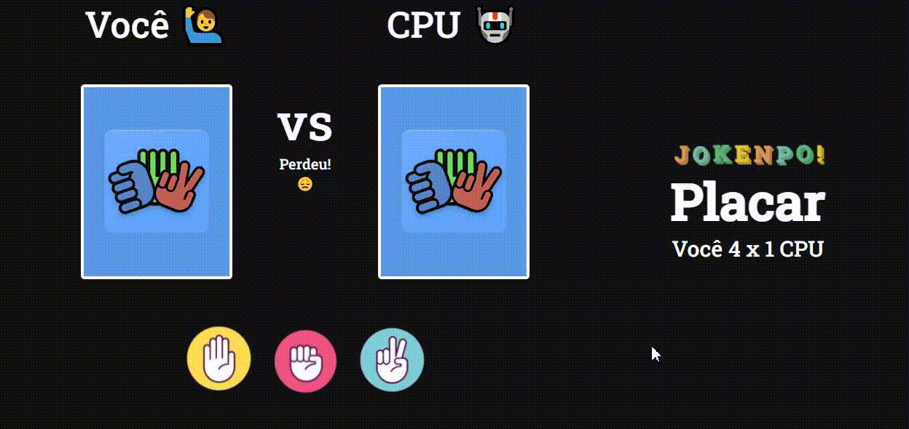

# Jokenpô

Pedra, papel e tesoura, também chamado em algumas regiões do Brasil de jokenpô (do japonês じゃんけんぽん, jankenpon), é um jogo de mãos recreativo e simples para duas ou mais pessoas, que não requer equipamentos nem habilidade. 

O jogo é frequentemente empregado como método de seleção (como na escolha de equipes para a prática desportiva, por exemplo), assim como lançar moedas, jogar dados, entre outros. No entanto, diferentemente desses métodos que se baseiam exclusivamente em sorte, pedra-papel-tesoura pode ser jogado com um pouco de habilidade. Principalmente se o jogo se estender por vários turnos com o mesmo jogador, este pode reconhecer e explorar a lógica do comportamento do adversário (perceber e anteceder as jogadas do adversário).

<small>Fonte: <a href="https://pt.wikipedia.org/wiki/Pedra,_papel_e_tesoura">Wikipédia</a></small>

## Ficha Técnica

Este projeto usa as tecnologias HTML, CSS e Javascript. 

Caso queira contribuir, tenho algumas sugestões:

    - Responsividade
    - Salvar histórico de jogo em Localstorage

## Imagens do Projeto

